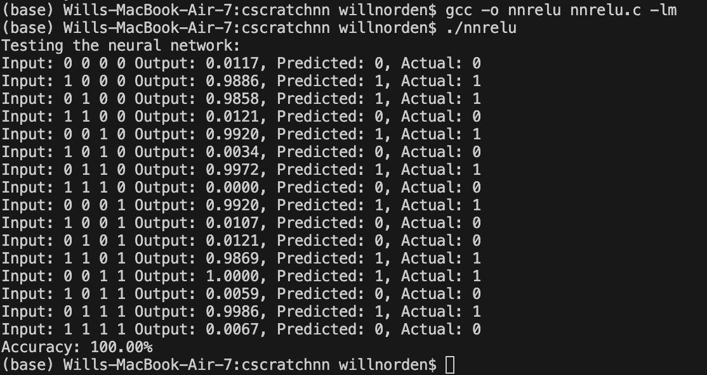
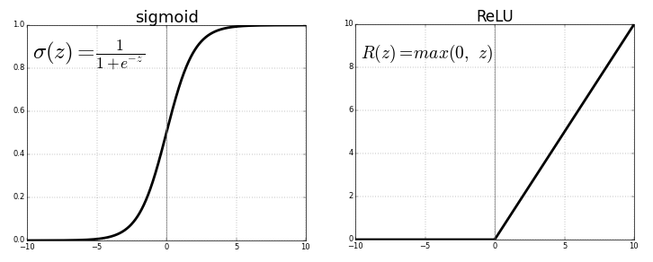
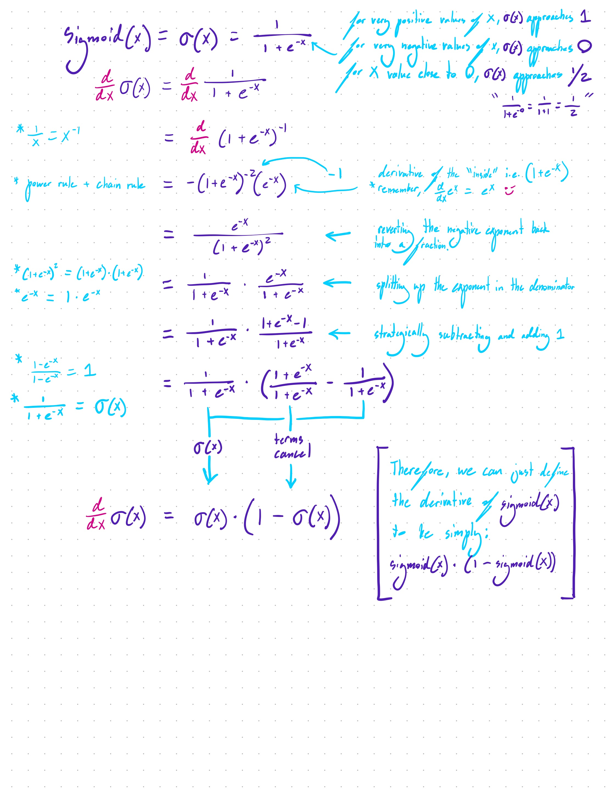

A simple, proof of concept neural network in C, mainly for strengthening my mathematical intuition.

V1 was fitting to the nonlinear XOR function. Used just two bit inputs, producing 4 outputs, and used only sigmoid activations. 

# V2

This version uses ReLU activations in the hidden layer, and uses sigmoid activation for the output layer to make sure we normalize between 0 and 1. Also provides an accuracy score between predicted and desired outputs.

## How To Run

This one is simple. No packages or libraries to pip install. Just create a directory to store the file, and name your file something like `neuralnetwork.c`. Paste in my code from `nnV2.c`.

To compile, cd into the directory, and: 

```bash
gcc -o neuralnetwork neuralnetwork.c -lm
```

To run: 

```bash
./neuralnetwork
```

In my code, you should see the following:

```c
void generate_training_data(double inputs[NUM_TRAINING_EXAMPLES][INPUT_NEURONS], 
                            double outputs[NUM_TRAINING_EXAMPLES][OUTPUT_NEURONS]) {

    // DESIRED OUTPUT FUNCTION.
    int output_pattern[16] = {0,1,1,0,1,0,1,0,1,0,0,1,1,0,1,0};
```

`int output_pattern[16]` is where I perscribed my desired 4 bit truth table outputs. It's an arbitrary sequence that requires lots of nonlinearities to fit to. 

## Your results should look something like this:



---

## Some mathematical background:

This is a graphical visualization of how both of the activation functions used in this network behave:



The following functions define the ReLU activation function, as well as its derivative (needed for backprop):

```c
// Activation function: Rectified Linear Unit (ReLU)
// ReLU returns the input if it's positive, otherwise it returns 0
double relu(double x) {
    return (x > 0) ? x : 0;
}

// Derivative of ReLU function
// Used in backpropagation to calculate gradients
double relu_derivative(double x) {
    return (x > 0) ? 1 : 0;
}
```

The ReLU function is basically the closest thing we can get to a plain old `y = x` linear function while still being able to fit to nonlinear problems. When `x > 0`, `y = x`, otherwise `y = 0`. 

For its derivative, `d/dx x` always equals `1`, so we can replicate this function with `return (x > 0) ? 1 : 0`.

How about the Sigmoid function?

```c
// Activation function: Sigmoid
// Maps any input to a value between 0 and 1
double sigmoid(double x) {
    return 1 / (1 + exp(-x));
}
```

See the graph and equation in the image above. As values of x approach infinity, outputs of sigmoid(x) approach 1. As x approaches negative infinity, sigmoid(x) approaches 0. At `x = 0`, sigmoid(x) returns 1/2. `1/(1+e^-0)` = `1/(1+1)` = `1/2`

```c
// Derivative of sigmoid function
// Used in backpropagation to calculate gradients
// This represents the slope of the sigmoid function at a given point
double sigmoid_derivative(double x) {
    return x * (1 - x); // Simplified derivative based on the sigmoid output
    // This simplification works because we're passing in the sigmoid output, not the input
}
```

So, why can we say that the derivative of sigmoid(x) is equal to (1 - sigmoid(x))?
`d/dx s(x) = s(x) * (1 - s(x))`

I have provided a full derivation of this, with hand-drawn comments that I hope are legible. Those strange curvy letters that I use are capital F's:


